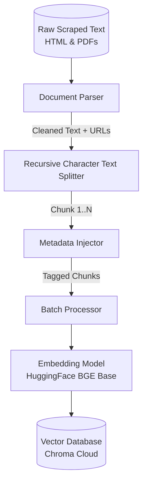

# 🧩 Deep Dive: Chunking & Embedding Pipeline Architecture

This document details the exact methodology for processing the scraped mutual fund data (from the 20 official URLs), chunking it effectively, and creating vector embeddings. This pipeline runs immediately after the GitHub Actions scraping step.

---

## **1. Pipeline Flow Diagram**



---

## **2. Document Parsing Strategy**

Before we chunk, we must clean the raw data retrieved by the Scraping Service.

### **A. PDF Documents (Factsheets, SID, KIM, SEBI)**
- **Tool:** `pdfplumber` or `Unstructured` 
- **Handling Tables:** Financial factsheets contain heavy tabular data (Expense Ratios, Returns). We will use parsers that maintain table rows as single contiguous strings so the LLM doesn't lose context between columns.
- **Cleaning:** Strip out standard footers, page numbers, and disclaimers that repeat recursively on every page to save tokens and prevent noise.

### **B. HTML Documents (AMFI, FAQs, Load Structures)**
- **Tool:** `BeautifulSoup`
- **Handling:** Extract targeted `<div>` or `<main>` tags containing the actual content. Strip scripts, styles, and navigation menus.

---

## **3. Chunking Strategy**

Mutual fund data is highly contextual. If an "Expense Ratio" is disconnected from its "Scheme Name", the answer will be hallucinated. We use a context-aware approach.

### **Configuration**
- **Method:** `RecursiveCharacterTextSplitter` (from LangChain).
- **Chunk Size:** `~400 - 500 tokens` (roughly 1500-2000 characters). This provides enough room to fit an entire FAQ answer or a descriptive financial paragraph.
- **Chunk Overlap:** `~50 tokens` (roughly 200 characters). Ensures sentences split across chunks don't lose context.
- **Separators:** `["\n\n", "\n", ".", " ", ""]` (Splits by paragraphs first, then sentences).

### **Handling Context Loss (Advanced Step)**
To ensure chunks don't lose the "context" of what scheme they belong to, we strongly couple the text chunks with precise metadata.

---

## **4. Metadata Architecture**

Every single chunk **must** contain a standard metadata payload. This is mandatory for the strict "1 source link" constraint.

**Metadata Schema per Chunk:**
```json
{
  "source_url": "https://www.sbimf.com/...",    // Mandatory for citing the answer
  "document_type": "Factsheet",                 // e.g., Factsheet, KIM, FAQ
  "chunk_id": "doc1_chunk45",                   // For tracking/updating
  "last_updated": "2023-10-25"                  // Mandatory for the footer date
}
```

---

## **5. Embedding Strategy**

Once chunked and tagged, text is converted into vector representations.

### **Model Selection**
- **Primary Choice:** `BAAI/bge-base-en-v1.5` (HuggingFace). A completely free local option that performs exceptionally well on financial nomenclature without hitting any API rate limits.

### **Execution (Batching)**
To avoid hitting API rate limits during the daily 9:15 AM GitHub Actions run:
- Chunks will be sent in batches of exactly `100 chunks` per API call.
- Implement exponential backoff if the API returns a `429 Too Many Requests` error.

---

## **6. Vector Store Management**

Where the numerical representations live.

- **Technology:** `Chroma Cloud` (Hosted via API).
- **Daily Refresh Strategy:**
  1. The GitHub Action spins up.
  2. Scrapes data -> Parses -> Chunks -> Embeds.
  3. Uses `upsert()` to transmit vectors and metadata to the cloud.
  4. This provides instant updates to the live chatbot without needing to re-download or commit giant FAISS files.
