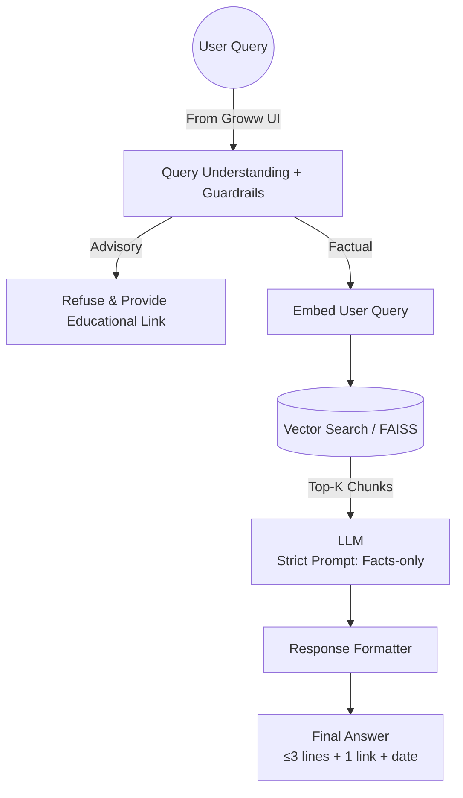

Here’s a **detailed, implementation-ready RAG architecture** tailored to your **Groww-style Mutual Fund FAQ Assistant**. I’ll keep it structured so you can directly explain it in interviews *and* build it.

---

# 🧠 **RAG Architecture – Mutual Fund FAQ Assistant (Groww UI)**

## **1. High-Level Flow**



---

# ⚙️ **2. System Components (End-to-End)**

## **A. Data Ingestion Layer**

### **Input Sources (Strict: 20 Official URLs)**

*Note: Currently, no static PDFs will be provided directly; the system must scrape or extract text directly from the URLs below.*

**🟢 Scheme Documents (Factsheets / KIM / SID)**
* `https://www.sbimf.com/docs/default-source/factsheets/sbi-bluechip-fund-factsheet.pdf`
* `https://www.sbimf.com/docs/default-source/kims/sbi-bluechip-fund-kim.pdf`
* `https://www.sbimf.com/docs/default-source/sids/sbi-bluechip-fund-sid.pdf`
* `https://www.sbimf.com/docs/default-source/factsheets/sbi-flexicap-fund-factsheet.pdf`
* `https://www.sbimf.com/docs/default-source/kims/sbi-flexicap-fund-kim.pdf`
* `https://www.sbimf.com/docs/default-source/sids/sbi-flexicap-fund-sid.pdf`
* `https://www.sbimf.com/docs/default-source/factsheets/sbi-long-term-equity-fund-factsheet.pdf`
* `https://www.sbimf.com/docs/default-source/kims/sbi-long-term-equity-fund-kim.pdf`
* `https://www.sbimf.com/docs/default-source/sids/sbi-long-term-equity-fund-sid.pdf`

**🟢 AMC Help / Support / Processes**
* `https://www.sbimf.com/en-us/investor-services/downloads`
* `https://www.sbimf.com/en-us/investor-services/account-statement`
* `https://www.sbimf.com/en-us/investor-services/capital-gain-statement`
* `https://www.sbimf.com/en-us/investor-services/faq`

**🟢 Charges / Risk / Scheme Info Pages**
* `https://www.sbimf.com/en-us/investor-services/total-expense-ratio`
* `https://www.sbimf.com/en-us/investor-services/load-structure`

**🟢 AMFI (Educational + Rules)**
* `https://www.amfiindia.com/investor-corner/knowledge-center/mutual-funds-basics`
* `https://www.amfiindia.com/investor-corner/knowledge-center/riskometer`
* `https://www.amfiindia.com/investor-corner/knowledge-center/systematic-investment-plan`

**🟢 SEBI (Regulatory / Investor Guidance)**
* `https://www.sebi.gov.in/sebi_data/faqfiles/jan-2023/1675076141717.pdf`
* `https://www.sebi.gov.in/investors/investor-education`

### **Process (Scraping Service & Scheduler)**

1. **Scraping Service**
   * A dedicated service that dynamically downloads and pulls text content from the **20 URLs** provided above.
   * Uses HTML scraping tools (e.g., BeautifulSoup) for web pages.
   * Uses PDF parsing tools (e.g., PyPDF2/pdfplumber) for the PDF URLs.

2. **Automated Scheduler (GitHub Actions)**
   * **Frequency:** Runs automatically **every day at 9:15 AM** (IST).
   * **Purpose:** Ensures the corpus is refreshed with the latest AMC factsheets, expense ratios, and SEBI regulations right before the market fully kicks in.
   * **Implementation:** Executed via a **GitHub Actions** workflow (`cron: '45 3 * * *'` for 9:15 AM IST) that runs the scraping service, processes the embeddings, and pushes the updated vector store to the server.

### **Output**

* Clean raw text documents

---

## **B. Data Preprocessing Layer**

### **Steps**

1. **Cleaning**

   * Remove headers, footers, noise
2. **Chunking**

   * Split into **small chunks (300–500 tokens)**
   * Keep **semantic meaning intact**
3. **Metadata Tagging**
   Each chunk includes:

   * Scheme name
   * Document type (factsheet/KIM/SID)
   * Source URL
   * Section (expense ratio, exit load, etc.)

### ✅ **Why Important**

* Improves retrieval accuracy
* Ensures correct citation

---

## **C. Embedding Layer**

### **What Happens**

* Convert each chunk → **vector embedding**

### **Tools**

* HuggingFace BGE Embeddings (`BAAI/bge-base-en-v1.5`)

### **Output**

* Numerical representation of each chunk

---

## **D. Vector Database (Retriever Layer)**

### **Storage**

* Use: **Chroma Cloud** (Hosted Vector Database)
  * Eliminates the need for local storage of indices.
  * Allows the chatbot to connect via API.

### **What It Stores**

* Embedding vectors
* Enhanced Metadata (Scheme name, Section, source link, last updated)
* Chunk IDs for upserting updates.

---

## **E. Query Processing Layer**

### **Step 1: User Query Input**

From Groww-style UI:

> “What is the expense ratio of XYZ fund?”

---

### **Step 2: Guardrails (VERY IMPORTANT)**

Classify query into:

* ✅ **Factual Query**
* ❌ **Advisory Query**

#### **If Advisory →**

* Trigger **Refusal System**
* Return:

  * Polite message
  * Educational link (AMFI/SEBI)

---

### **Step 3: Query Embedding**

* Convert user query → vector

---

### **Step 4: Retrieval**

* Perform **similarity search**
* Fetch **Top-K relevant chunks (k=3–5)**

---

## **F. LLM Generation Layer**

### **Input to LLM**

* User query
* Retrieved chunks
* Strict system prompt

---

### **🔒 Prompt Design (CRITICAL)**

```
You are a Mutual Fund FAQ Assistant.

Rules:
- Answer only from provided context
- Do NOT give advice or opinions
- Keep answer ≤ 3 sentences
- Include exactly ONE source link
- If answer not found → say "Information not available in sources"
- If query is advisory → refuse politely

Output format:
Answer:
<text>

Source:
<link>

Footer:
Last updated from sources: <date>
```

---

### **Output**

* Short, factual, grounded answer

---

## **G. Response Post-Processing Layer**

### **What It Ensures**

* ≤ 3 sentences
* Only **one link**
* Proper formatting
* Add footer date

---

## **H. Frontend (Groww-Style UI)**

### **Components**

* Chat window
* Input box
* Response cards

### **UI Elements**

* Welcome message
* Example questions
* Disclaimer:
  **“Facts-only. No investment advice.”**

---

# 🔄 **3. Multi-Thread Chat Handling**

### **Approach**

* Assign **session ID per user/chat**
* Store:

  * Chat history
  * Previous queries

### **Why**

* Supports multiple conversations simultaneously
* Improves UX

---

# 🛑 **4. Refusal Handling System**

### **Trigger Conditions**

* “Should I invest?”
* “Which fund is better?”

### **Response**

```
I can only provide factual information about mutual funds and cannot offer investment advice.

You can learn more here:
<AMFI/SEBI link>

Last updated from sources: <date>
```

---

# 🧪 **5. Evaluation & Validation**

### **Checkpoints**

* ✅ Correct answer
* ✅ Correct source
* ✅ No hallucination
* ✅ Proper refusal

---

# ⚠️ **6. Known Limitations**

* Small dataset → limited coverage
* PDF parsing errors
* LLM may hallucinate if prompt is weak
* Data freshness depends on source updates


# 🚀 **7. Optional Enhancements (If Time)**

* Hybrid search (keyword + vector)
* Re-ranking results
* Better UI (React instead of Streamlit)
* Caching frequent queries


# 🧠 **Final Architecture Summary (1 Line)**

👉 *A pipeline that retrieves relevant mutual fund data from official sources and uses an LLM with strict guardrails to generate short, factual, and source-backed answers.*

