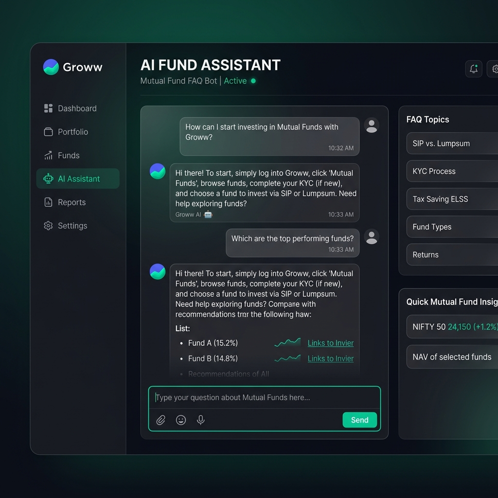

# 🚀 Groww RAG Chatbot: Mutual Fund FAQ Assistant

A production-ready, cloud-native RAG (Retrieval-Augmented Generation) chatbot designed to provide accurate, factual information about Mutual Funds. Built with a **Groww-style dark theme** and a robust FastAPI backend.

## 🌟 Key Features

-   **Intelligent Retrieval**: Uses a multi-stage RAG pipeline to fetch relevant context from legal documents (SID/KIM), factsheets, and SEBI/AMFI guidelines.
-   **Guardrails & Compliance**: Strict factual adherence. The bot refuses to give financial advice and redirects users to educational resources for specific advisory queries.
-   **Conversation Persistence**: Multi-threaded chat history management for context-aware interactions.
-   **Modern UI**: High-performance frontend built with Next.js, Tailwind CSS, and a premium dark mode aesthetic.
-   **Groq-Powered Generation**: Ultra-fast LLM responses using Groq's LPU™ Inference Engine.

## 🏗️ Architecture

The project is structured into modular phases:
-   **Phase A-D**: Data Scraping, Ingestion, Embedding, and Vector Storage.
-   **Phase E-H**: Query Processing, LLM Generation (Groq), Post-processing, and Chat History.
-   **Phase I**: Evaluation and Feedback mechanisms.

## 🛠️ Tech Stack

-   **Frontend**: Next.js, TypeScript, Tailwind CSS
-   **Backend**: FastAPI, Python
-   **LLM**: Groq (Llama 3 / Mixtral)
-   **Vector DB**: (Specify Vector DB, e.g., Pinecone/Chroma/Qdrant)
-   **Tools**: BeautifulSoup (Scraping), LangChain/LlamaIndex

## 🚀 Getting Started

### Backend Setup
1. Clone the repo: `git clone https://github.com/17122016/Groww_Rag_chatbot.git`
2. Install dependencies: `pip install -r requirements.txt`
3. Configure `.env` with your GROQ_API_KEY and other credentials.
4. Run the API: `python api.py`

### Frontend Setup
1. Navigate to `/frontend`: `cd frontend`
2. Install dependencies: `npm install`
3. Run the dev server: `npm run dev`

## 📊 Roadmap
- [x] Phase A: Automated Data Ingestion
- [x] Phase E-G: Core RAG Pipeline
- [ ] Phase I: Production Scaling & Monitoring
